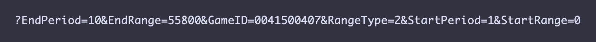
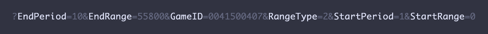
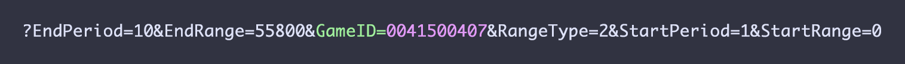
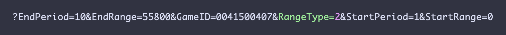
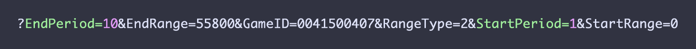
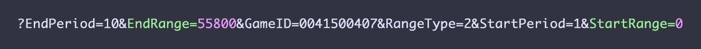

```{r setup, include=FALSE}
knitr::opts_chunk$set(echo = TRUE)
```

#### ** **A Work in Progress** **

## NBA Stats API Resources

This is not official documentation— it's a mash-up of information I have gathered from tinkering with the API, and the hard work of those who have done this before me, including:

* The extensive [“stats.nba.com Endpoint Documentation”](https://github.com/seemethere/nba_py/wiki/stats.nba.com-Endpoint-Documentation) from the [nba_py wiki](https://github.com/seemethere/nba_py/wiki/Completed-Work-Log);
* Daniel Welch's [“Documenting the NBA Stats API”](http://danielwelch.github.io/documenting-the-nba-stats-api.html);
* Savvas Tjortjoglou's [“How to Track NBA Player Movements in Python”](http://savvastjortjoglou.com/nba-play-by-play-movements.html);
* Daniel Forsyth's [“Exploring NBA Data in Python”](http://www.danielforsyth.me/exploring_nba_data_in_python/)
*  Tanya Cashorali's [“NBA Player Movement Data in R”](http://tcbanalytics.com/blog/nba-movement-data-R.html#.WCncXdwwd_x); and
* Rajiv Shah's [“NBA SportVu Analysis”](http://projects.rajivshah.com/blog/2016/04/02/sportvu_analysis/) blog series, and [NBA_SportVu](https://github.com/rajshah4/NBA_SportVu) GitHub repo

## Box Score Endpoint Parameters

As you may have gathered from the list of references above, the stats.nba.com endpoints have been well-documented.[^1] However, since the NBA API no longer supports the SporVu data in the way it had when many of these prior tutorials were written, it was possible to use a `movements` data to determine what players were on the court at a given time. 

In order to get lineups and on/off data now, we have to use the **`boxscoreadvanced2`** endpoint. For all `GET` requests to `stats.nba.com/stats/boxscoreadvancedv2/`, the following parameters are required:  

  * `GameID`
  * `StartPeriod`
  * `EndPeriod`
  * `StartRange`
  * `EndRange`
  * `RangeType`

The parameters follow a question mark that comes at the end of the endpoint name, and are separated by ampersands (`&`), and are, by default, set up to capture the entire game. 

  

While the full URL might look something like this:

```{r, eval=FALSE}
`http://stats.nba.com/stats/boxscoreadvancedv2?EndPeriod=10&EndRange=55800&GameID=0041500407&RangeType=2&StartPeriod=1&StartRange=0`
```

The JSON retrieved, then, identifies the parameter settings as such:
```{r, eval=FALSE}
parameters: {

    "GameID": "0041500407",
    "StartPeriod": 1,
    "EndPeriod": 10,
    "StartRange": 0,
    "EndRange": 55800,
    "RangeType": 2

}
```

These match the parameters seen in the URL:



In order for any of this to be useful, we have to actually know what those parameters _mean_. Some of them are fairly obvious. 

### GameID  

Every game has a unique `GameID`— for example, for Game 7 of the 2016 NBA Finals, `GameID=0041500407`.[^2] Often, `GameID` will be the only parameter you'll need to pass to functions such as [Rajiv Shah's](https://github.com/rajshah4/NBA_SportVu) used to retrieve play-by-play data. 



### RangeType

This was the parameter that initially tripped me up, since it determines which of the other parameters are actually _used_ as arguments in your call to the API. `RangeType` can take three values: `0`, `1`, and `2`.



* If `RangeType=0`, then, regardless of the values of other parameters, you will be retrieving the data for the entirety of the game specified in `GameID`.  
* If `RangeType=1`, your data will be retrieved for the entirety of periods specified in `StartPeriod` and `EndPeriod`, regardless of what values are assigned to `StartRange` and `EndRange`.
* If `RangeType=2`, the you will retrieve data for the time period specified in `StartRange` and `EndRange` (discussed in further detail, below).

However, all of the parameters, _including_ those ignored, depending on `RangeType`, _are_ **required**. 


### StartPeriod & EndPeriod  

The `StartPeriod` and `EndPeriod` parameters are assigned values according to the periods of the game for which you want to collect information. Despite the fact that there are rarely 10 periods in a basketball game, that default value captures a regulation-length game, with overtime periods to spare. 



### StartRange & EndRange  

The values for `StartRange` and `EndRange` are **tenths of seconds**. So, to get the first ten minutes of a game, you would set `StartRange=0` and `EndRange=6000`. 



## Parsing Box Score JSON with R

Here we'll be retrieving box score data from stats.nba.com for the aforementioned Game 7 using parameters set directly in the URL.  

Note that, as always, if you're running the R code yourself, you'll need to install any libraries/packages you don't already have, which you do by running `install.packages("packagename")`.  

```{r boxscore JSON, message=FALSE, warning=FALSE}
## strings as factors to FALSE
options(stringsAsFactors = FALSE)

## load libraries
library(RCurl)
library(jsonlite)
library(tidyverse)

## get JSON from stats.nba.com
df <- fromJSON("http://stats.nba.com/stats/boxscoretraditionalv2?EndPeriod=10&EndRange=55800&GameID=0041500407&RangeType=2&StartPeriod=1&StartRange=0")
```

Let's look at the parameters to make sure they match up with what we were expecting, based on the URL.

```{r params, warning=FALSE}
## unlist parameters from JSON
params <- unlist(df$parameters)

## view parameters
params
```

Note that the entire game is captured, regardless of `RangeType` here, as the `Period` and `Range` parameters are greater than the game's actual duration.


If we look at the `resultSets` from the JSON, we can see that there are actually three different sets of results nested in the JSON: **`PlayerStats`**, **`TeamStats`**, and **`TeamStarterBenchStats`**.

```{r resultSets, warning=FALSE}
## get resultSet from JSON
resultSets <- df[['resultSets']]

## view structure of resultSet
str(resultSets)
```

The structure of the new `resultSets` data frame isn't useful for analysis in R. The end goal is usually [*Tidy Data*](http://www.jstatsoft.org/v59/i10/paper), but, at this point, we're just aiming for something that doesn't involve two columns of lists -- in this case, the **`PlayerStats`**. 

### Getting `PlayerStats` Data

This code below is a bit messy at the moment, which is ok for now, since we'll actually only be looking for specific values from the box score moving forward-- it's also often the nature of working with JSON in R. However, (_note to self_), I could probably clean things up a bit.

```{r playerstats}

## get headers
headers <- unlist(unlist(df$resultSets$headers[[1]]))

## data to matrix
rowsets <- unlist(df$resultSets$rowSet[[1]])
## convert to data frame
rowsets.df <- as.data.frame(rowsets)

## convert column data types
rowsets.df[, c(10,11,13,14,16,17,19:28)] <- sapply(rowsets.df[, c(10,11,13,14,16,17,19:28)], as.integer)
rowsets.df[, c(12,15,18)] <- sapply(rowsets.df[, c(12,15,18)], as.numeric)

## convert to tbl_df
rowsets_tbl <- tbl_df(rowsets.df)

## assign headers as column names
names(rowsets_tbl)[1:28] = c(headers)

## look at what we've got
head(rowsets_tbl)

```

### Saving Your Work

The following code chunks aren't being evaluated. But it's always good to know how to get your data in and out of R, and/or into a format you can use with the platform of your choice. 

```{r write file, eval=FALSE}
## save your data as a csv file
write.csv(rowsets_tbl, file = "~/data/rowsets_tbl.csv", row.names = FALSE)
```


```{r read in file, eval=FALSE}
## read a csv file in using readr
library(readr)
rowsets_tbl <- read_csv("~/data/rowsets_tbl.csv", col_types = cols(MIN = col_character()))

```

