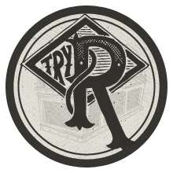
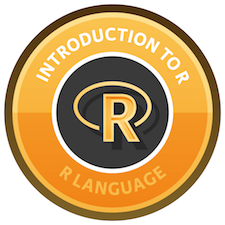

```{r setup, include=FALSE}
knitr::opts_chunk$set(echo = TRUE)
```

# **** **Work In Progress** ****

## Trying R -- NSA (no software attached)

If you've never used R before, and are trigger shy about downloading it on your computer (there's no reason to be, but everyone has their “things”), there are two free, in-browser, interactive tutorials that will take you through the absolute basics.  

* [**Try R**](http://tryr.codeschool.com/), by CodeSchool is a quick intro (~20 minutes) that will take you through simple syntax, and basic classes/types of objects you'll be working with  


* DataCamp's free [**Introduction to R**](https://www.datacamp.com/courses/free-introduction-to-r) course is a bit more involved (estimated total time around 4 hours), but will also cover more material: _“In this introduction to R, you will master the basics of this beautiful open source language, including factors, lists and data frames. With the knowledge gained in this course, you will be ready to undertake your first very own data analysis.”_


## Getting R and RStudio

Though everything in this tutorial can be done with R on its own, the RStudio IDE will make things much easier, especially if you're used to working with a visual interface to spreadsheets. Either way, you'll first need to download R itself, which you  can do from the [R Project website](https://www.r-project.org/). You'll be asked to select a CRAN (Comprehensive R Archive Network) mirror for your download -- I usually go with the one hosted by Statlib at Carnegie Mellon, but you can choose whichever you like, and then select either Linux, Mac, or Windows, depending on your operating system.  


This is an R Markdown document. Markdown is a simple formatting syntax for authoring HTML, PDF, and MS Word documents. For more details on using R Markdown see <http://rmarkdown.rstudio.com>.

