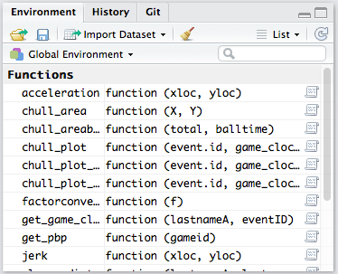
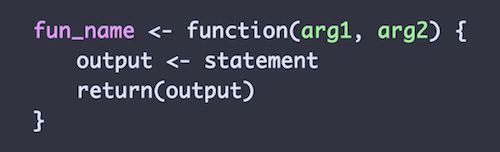

```{r setup, include=FALSE}
knitr::opts_chunk$set(echo = TRUE)
```

#### ** **Work in Progress** **

## Streamlining the Data Retrieval Process

### Using Functions

In order to speed up the process of retrieving and parsing data from the stats.nba.api, it's a good idea to use functions for tasks that you'll be repeating. Luckily, we don't have to start from scratch, as Rajiv Shah's [_functions.R](https://github.com/rajshah4/NBA_SportVu/blob/master/_functions.R) from his [NBA_SportVu](https://github.com/rajshah4/NBA_SportVu) repo already contains much of what we'll need.

To load those functions, we'll use `source()` when loading our libraries, but you'll need to download the file in order for this to work on your own machine.

```{r loading libs src funs, message=FALSE}
## load libraries and functions from source
library(RCurl)
library(jsonlite)
library(tidyverse)
source("_functions.R")
```

If you're in RStudio, the functions should appear in the **Environment** section of your workspace (usually in the upper right-hand quadrant).  



We won't be using all of these functions (some of them will not work for the current season, as certain parts of the API have been depreciated), but let's take a quick look at one of them that we will be using (**`get_pbp`**) to get a better sense of what's involved. 

```{r get_pbp fun, eval=FALSE}

get_pbp <- function(gameid){
  #Grabs the play by play data from the NBA site
  URL1 <- paste("http://stats.nba.com/stats/playbyplayv2?EndPeriod=10&EndRange=55800&GameID=",gameid,"&RangeType=2&StartPeriod=1&StartRange=0",sep = "")
  the.data.file<-fromJSON(URL1)
  test <-the.data.file$resultSets$rowSet
  test2 <- test[[1]]
  test3 <- data.frame(test2)
  coltest <- the.data.file$resultSets$headers
  colnames(test3) <- coltest[[1]]
  return (test3)
  }

```

The basic structure of a user-defined function in R involves a function name, arguments that need to be passed to the function, and the code telling for what the function should do and what data it should return. 



