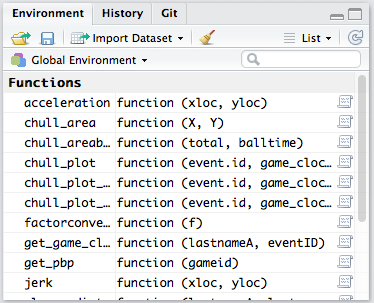
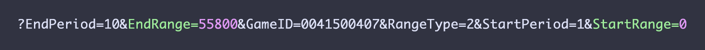

# NBA Stats API Part II -- Play-by-Play
Mara Averick  


#### ** **Work in Progress** **

## Streamlining the Data Retrieval Process

### Functions

In order to speed up the process of retrieving and parsing data from the stats.nba.api, it's a good idea to use functions for tasks that you'll be repeating. Functions can also help you avoid doing things that are easy to mess up, like finding and setting parameters, such as `GameID`, directly in the URL.  

#### Defining Functions in R 

In basic tersm, the structure of a user-defined function in R (see below), is as follows: a function name set using the `<-` assignment operator, argument(s) required put in parentheses `()`, and code for what the function should do and what data it should return in curly braces `{}`. 

More formally, [Hadley Wickham](http://adv-r.had.co.nz/Functions.html#function-components) defines the three components of a function as:[^1]  

* the `body()`, the code inside the function.  

* the `formals()`, the list of arguments which controls how you can call the function.  

* the `environment()`, the “map” of the location of the function’s variables.

 

Here's a simple function to multiply a variable, `x`, by 2, and return that value. Once I've defined that function, I can use it by passing it a value (argument) either directly, or indirectly by assigning a value to `x`.


```r
## name and define a function for multiplying by two
times_two <- function(x){
  return(x * 2)
}

## multiply 6 by 2 with function
times_two(6)
```

```
## [1] 12
```

```r
## assign x value
x <- 4
## use function with x
times_two(x)
```

```
## [1] 8
```

#### Loading Functions Into R

As far as functions go for retrieving data from stats.nba.com goes, we don't have to start from scratch. Rajiv Shah's [_functions.R](https://github.com/rajshah4/NBA_SportVu/blob/master/_functions.R) in his [NBA_SportVu](https://github.com/rajshah4/NBA_SportVu) repo already contains much of what we'll need.

To load those functions, we'll use `source()` when loading our libraries, but you'll need to download the file in order for this to work on your own machine.


```r
## set up env't preferences
options(stringsAsFactors = FALSE)

## load libraries and functions from source
library(RCurl)
library(jsonlite)
library(tidyverse)
source("_functions.R")
```

If you're in RStudio, the functions should appear in the **Environment** section of your workspace (usually in the upper right-hand quadrant).  



#### Using `get_pbp`

We won't be using all of these functions (some of them will not work for the current season, as certain parts of the API have been depreciated), but let's take a quick look at one of them that we will be using (**`get_pbp`**) to get a better sense of what's involved.[^2]


```r
get_pbp <- function(gameid){
  #Grabs the play by play data from the NBA site
  URL1 <- paste("http://stats.nba.com/stats/playbyplayv2?EndPeriod=10&EndRange=55800&GameID=",gameid,"&RangeType=2&StartPeriod=1&StartRange=0",sep = "")
  the.data.file<-fromJSON(URL1)
  test <-the.data.file$resultSets$rowSet
  test2 <- test[[1]]
  test3 <- data.frame(test2)
  coltest <- the.data.file$resultSets$headers
  colnames(test3) <- coltest[[1]]
  return (test3)
  }
```

Ignoring, for the time being, the tests, this function should look pretty similar to the code we ran to get box score data. The URL has all of the same parameters, but `GameID` is set by a user-assigned value, `gameid`. Inside of `get_pbp`, data is retrieved by passing the URL to the `fromJSON` function (from the [**`jsonlite`**](https://github.com/jeroenooms/jsonlite) package).

So, if we wanted to get the play-by-play data for the same game we looked at in the box score section, we would do the following:

```r
## set gameid
gameid <- "0041500407"
## retrieve pbp data
pbp <- get_pbp(gameid)
```

### What's in the play-by-play data?  

Let's look at our data a bit more closely. First we'll convert our data frame to a `tbl` class-- a format that will allow us to make full use of the [**`dplyr`**](https://github.com/hadley/dplyr) package. Then we can examine the data using the `glimpse()` function, which returns a dense summary, limited to what can be viewed on the screen (i.e. no text wrapping).


```r
## convert to tbl_df
pbp <- tbl_df(pbp)

## glimpse the data
glimpse(pbp)
```

```
## Observations: 442
## Variables: 33
## $ GAME_ID                   <chr> "0041500407", "0041500407", "0041500...
## $ EVENTNUM                  <chr> "0", "1", "2", "3", "4", "5", "6", "...
## $ EVENTMSGTYPE              <chr> "12", "10", "2", "4", "2", "4", "1",...
## $ EVENTMSGACTIONTYPE        <chr> "0", "0", "78", "0", "58", "0", "40"...
## $ PERIOD                    <chr> "1", "1", "1", "1", "1", "1", "1", "...
## $ WCTIMESTRING              <chr> "8:11 PM", "8:11 PM", "8:12 PM", "8:...
## $ PCTIMESTRING              <chr> "12:00", "12:00", "11:39", "11:36", ...
## $ HOMEDESCRIPTION           <chr> NA, "Jump Ball Ezeli vs. Thompson: T...
## $ NEUTRALDESCRIPTION        <chr> NA, NA, NA, NA, NA, NA, NA, NA, NA, ...
## $ VISITORDESCRIPTION        <chr> NA, NA, "MISS Smith 5' Floating Jump...
## $ SCORE                     <chr> NA, NA, NA, NA, NA, NA, "2 - 0", NA,...
## $ SCOREMARGIN               <chr> NA, NA, NA, NA, NA, NA, "-2", NA, NA...
## $ PERSON1TYPE               <chr> "0", "4", "5", "4", "4", "5", "5", "...
## $ PLAYER1_ID                <chr> "0", "203105", "2747", "201939", "20...
## $ PLAYER1_NAME              <chr> NA, "Festus Ezeli", "JR Smith", "Ste...
## $ PLAYER1_TEAM_ID           <chr> NA, "1610612744", "1610612739", "161...
## $ PLAYER1_TEAM_CITY         <chr> NA, "Golden State", "Cleveland", "Go...
## $ PLAYER1_TEAM_NICKNAME     <chr> NA, "Warriors", "Cavaliers", "Warrio...
## $ PLAYER1_TEAM_ABBREVIATION <chr> NA, "GSW", "CLE", "GSW", "GSW", "CLE...
## $ PERSON2TYPE               <chr> "0", "5", "0", "0", "0", "0", "5", "...
## $ PLAYER2_ID                <chr> "0", "202684", "0", "0", "0", "0", "...
## $ PLAYER2_NAME              <chr> NA, "Tristan Thompson", NA, NA, NA, ...
## $ PLAYER2_TEAM_ID           <chr> NA, "1610612739", NA, NA, NA, NA, "1...
## $ PLAYER2_TEAM_CITY         <chr> NA, "Cleveland", NA, NA, NA, NA, "Cl...
## $ PLAYER2_TEAM_NICKNAME     <chr> NA, "Cavaliers", NA, NA, NA, NA, "Ca...
## $ PLAYER2_TEAM_ABBREVIATION <chr> NA, "CLE", NA, NA, NA, NA, "CLE", NA...
## $ PERSON3TYPE               <chr> "0", "5", "0", "0", "0", "0", "0", "...
## $ PLAYER3_ID                <chr> "0", "2544", "0", "0", "0", "0", "0"...
## $ PLAYER3_NAME              <chr> NA, "LeBron James", NA, NA, NA, NA, ...
## $ PLAYER3_TEAM_ID           <chr> NA, "1610612739", NA, NA, NA, NA, NA...
## $ PLAYER3_TEAM_CITY         <chr> NA, "Cleveland", NA, NA, NA, NA, NA,...
## $ PLAYER3_TEAM_NICKNAME     <chr> NA, "Cavaliers", NA, NA, NA, NA, NA,...
## $ PLAYER3_TEAM_ABBREVIATION <chr> NA, "CLE", NA, NA, NA, NA, NA, "CLE"...
```

As is to be expected, the play-by-play data is a sequence of events that occur, the order of which is recorded in the **`EVENTNUM`** variable. 

The players involved are identified by name and ID number, and, depending on team, the event is described as a string (AKA words) in the **`HOMEDESCRIPTION`**, **`NEUTRALDESCRIPTION`**, or **`VISITORDESCRIPTION`** columns.[^4]

The third and fourth columns give us **`EVENTMSGTYPE`**, and **`EVENTMSGACTIONTYPE`**, which correspond to the event type, and what happened. For example, let's take a look at the 212th play logged.  

```r
## get event record by EVENTNUM
event_212 <- filter(pbp, EVENTNUM == "212")

## look at EVENTMSG and ACTIONTYPE
select(event_212, 1:4)
```

```
## # A tibble: 1 × 4
##      GAME_ID EVENTNUM EVENTMSGTYPE EVENTMSGACTIONTYPE
##        <chr>    <chr>        <chr>              <chr>
## 1 0041500407      212            1                 79
```

```r
## look at description
select(event_212, 8)
```

```
## # A tibble: 1 × 1
##                                            HOMEDESCRIPTION
##                                                      <chr>
## 1 Green 26' 3PT Pullup Jump Shot (19 PTS) (Iguodala 3 AST)
```

This was a pull-up jumper, made by Draymond Green. The `EVENTMSGTYPE`, 1, indicates a "make"; and the `EVENTMSGACTIONTYPE`, 79, corresponds to _"Pullup Jump Shot"_ in the description.  

Not every message type has an action type, which makes sense, since you won't have a driving-hook substitution. Also, the meaning of the action type depends on the message type. For the EVENTMSGACTIONTYPE 1 indicates a jump shot for shooting EVENTMSGTYPEs (i.e. makes and misses), but, for EVENTMSGTYPE 9, a timeout, an EVENTMSGACTIONTYPE of 1 means it was a full timeout. For practical purposes, this means that if you are looking for a certain action type, you should always specify both the message _and_ action type.  

I have yet to come across a formal _“data dictionary”_, with respect to these. However, Rajiv Shah's [documentation](http://projects.rajivshah.com/sportvu/PBP_NBA_SportVu.html), with a few additions I've found will suffice for our purposes. _[If you have any to add, or any corrections, please message me, or submit it as an issue for [this page](https://github.com/batpigandme/nba_stats_docs) on GitHub.]_

#### **EVENTMSGTYPE**  
**1** - Make; **2** - Miss; **3** - Free Throw; **4** - Rebound; **5** - Out-of-Bounds / Turnover / Steal; **6** - Personal Foul; **7** - Violation; **8** - Substitution; **9** - Timeout; **10** - Jumpball; **12** - Start Q1(?); **13** - Start Q2(?)

#### **EVENTMSGACTIONTYPE**   
**1** - Jumpshot/Full Timeout; **2** - Lost Ball Turnover; **3** - ?; **4** - Traveling Turnover / Offensive Foul; **5** - Kicked Ball/Layup(?); **7** - Dunk; **10** - Free throw 1-1; **11** - Free Throw 1 of 2; **12** - Free Throw 2 of 2; **13** Free Throw 1 of 3; **14** Free Throw 2 of 3; **15** Free Throw 3 of 3; **30** - Out of bounds; **40** - Layup; **41** - Running Layup; **42** - Driving Layup; **47** - Turnaround Jump Shot; **50** - Running Dunk; **52** - Alley Oop Dunk; **55** - Hook Shot; **57** - Driving Hook Shot; **58** - Turnaround Hook Shot; **66** - Jump Bank Shot; **71** - Finger Roll Layup; **72** - Putback Layup; **79** - Pullup Jump Shot; **86** Turnaround Fadeaway Shot; **108** - Cutting Dunk Shot


Another way to explore `EVENTMSGTYPE` and `EVENTMSGACTIONTYPE` would be by looking at the different combinations of the two variables with their descriptors.  

```r
## get unique sets of EVENTMSG and ACTION TYPEs
eventmsg_combos <- pbp %>%
  select(one_of(c("EVENTMSGTYPE", "EVENTMSGACTIONTYPE"))) %>%
  distinct()
```
From looking at the number of unique combinations involving EVENTMSGACTIONTYPEs with a value of 0 or 1, it's clear that our makeshift data dictionary is incomplete. However, for now we'll leave those to be examined at a later date.  

### Dealing with Time

Date and time data can be a tricky business.[^3] The [**`lubridate`**](https://github.com/hadley/lubridate) library makes things a little easier, and I recommend checking out the package vignette if you want to learn more. 

In the play-by-play data we've loaded, there are two variables that contain `TIME`, one of which is a 12-minute countdown clock for each period (`PCTIMESTRING`). Since we want to look at this information relative to box score data, we'll need time in the form of tenths of seconds elapsed since the start of the game (the formatting for the `STARTRANGE` and `ENDRANGE` box score parameters).

 

Below, I've done this in two ways: step-by-step (wherein each step becomes a new variable), and as a single operation. 


```r
## load lubridate
library(lubridate)

## convert PCTIME to seconds
pbp$pcsecs <- period_to_seconds(ms(pbp$PCTIMESTRING))
## get period seconds elapsed
pbp$period_sec_elapsed <- abs((pbp$pcsecs - 720))
## convert to game seconds elapsed
pbp$game_sec_elapsed <- abs((pbp$pcsecs - 720)) + (((as.numeric(pbp$PERIOD)) - 1) * 720)
## convert to tenths of seconds for Range params
pbp$range_clock <- (pbp$game_sec_elapsed * 10)
```


```r
## load lubridate
library(lubridate)

## convert PCTIMESTRING for Range params
pbp$range_clock2 <- (abs(((period_to_seconds(ms(pbp$PCTIMESTRING))) - 720)) + (((as.numeric(pbp$PERIOD)) - 1) * 720)) * 10
```

Knowing the time in "box score" format, will allow us to figure out who is on the floor at any given moment during the game, which is critical information for deriving an array of "advanced metrics."

### Substitutions and Lineups  

Rather than work with the entire play-by-play data frame, let's first pull out the records of interest. Since substitutions have an EVENTMSGTYPE of 8, we'll want to pull those records.

```r
## filter pbp by EVENTMSGTYPE 8
pbp_subs <- pbp %>%
  filter(EVENTMSGTYPE == "8")
```

By looking at the descriptions, you can see that for a given substitution, the player _leaving_ the court is Player 1 (`PLAYER1_ID`), and the player coming in is Player 2 (`PLAYER2_ID`). 

Since manually editing the box score endpoint URL would be time consuming, and annoying, let's write a function to make things a bit easier. In keeping with the convention of the functions we've already loaded, it's a good idea to give it a name that begins with `get_`. We'll also want to set the `RangeType` to 2, since we're using the `StartRange` and `EndRange` parameters. For troubleshooting purposes, it's also a good idea to give the results of the steps within your function different names.


```r
## define function to get boxscoretraditionalv2
get_boxtrad <- function(gameid, startrange, endrange){
  #Grabs the box score data from NBA site
  URL1 <- paste("http://stats.nba.com/stats/boxscoretraditionalv2?EndPeriod=1&EndRange=",endrange,"&GameID=",gameid,"&RangeType=2&StartPeriod=1&StartRange=",startrange,"", sep = "")
  df<-fromJSON(URL1)
  test <- unlist(df$resultSets$rowSet[[1]])
  test1 <- as.data.frame(test)
  test1[, c(10,11,13,14,16,17,19:28)] <- sapply(test1[, c(10,11,13,14,16,17,19:28)], as.integer)
  test1[, c(12,15,18)] <- sapply(test1[, c(12,15,18)], as.numeric)
  test2 <- tbl_df(test1)
  headers <- unlist(unlist(df$resultSets$headers[[1]]))
  names(test2)[1:28] = c(headers)
  return(test2)
}
```

In addition to `gameid`, this function also requires us to set `startrange` and `endrange` parameters in order for it to run. We'll set the start to 0 (the beginning of the game), and the end to the value of `range_clock2` at the time of the first substitution.   

```r
## set arguments
gameid <- "0041500407"
startrange <- "0"
endrange <- "3020"

## get_boxtrad
boxscore_3020 <- get_boxtrad(gameid, startrange, endrange)

## glimpse results
glimpse(boxscore_3020)
```

```
## Observations: 10
## Variables: 28
## $ GAME_ID           <chr> "0041500407", "0041500407", "0041500407", "0...
## $ TEAM_ID           <chr> "1610612739", "1610612739", "1610612739", "1...
## $ TEAM_ABBREVIATION <chr> "CLE", "CLE", "CLE", "CLE", "CLE", "GSW", "G...
## $ TEAM_CITY         <chr> "Cleveland", "Cleveland", "Cleveland", "Clev...
## $ PLAYER_ID         <chr> "2544", "201567", "202684", "2747", "202681"...
## $ PLAYER_NAME       <chr> "LeBron James", "Kevin Love", "Tristan Thomp...
## $ START_POSITION    <chr> "F", "F", "C", "G", "G", "F", "F", "C", "G",...
## $ COMMENT           <chr> "", "", "", "", "", "", "", "", "", ""
## $ MIN               <chr> "5:02", "5:02", "5:02", "5:02", "5:02", "5:0...
## $ FGM               <int> 1, 1, 1, 0, 1, 1, 2, 0, 0, 0
## $ FGA               <int> 2, 4, 1, 2, 2, 2, 2, 3, 2, 1
## $ FG_PCT            <dbl> 0.50, 0.25, 1.00, 0.00, 0.50, 0.50, 1.00, 0....
## $ FG3M              <int> 0, 0, 0, 0, 0, 1, 1, 0, 0, 0
## $ FG3A              <int> 0, 1, 0, 1, 0, 1, 1, 0, 2, 1
## $ FG3_PCT           <dbl> 0, 0, 0, 0, 0, 1, 1, 0, 0, 0
## $ FTM               <int> 0, 0, 0, 0, 0, 0, 0, 0, 0, 0
## $ FTA               <int> 0, 0, 0, 0, 0, 0, 0, 0, 0, 0
## $ FT_PCT            <dbl> 0, 0, 0, 0, 0, 0, 0, 0, 0, 0
## $ OREB              <int> 0, 2, 0, 0, 0, 0, 0, 0, 1, 0
## $ DREB              <int> 3, 1, 2, 0, 0, 1, 0, 1, 0, 2
## $ REB               <int> 3, 3, 2, 0, 0, 1, 0, 1, 1, 2
## $ AST               <int> 0, 0, 0, 1, 1, 1, 1, 1, 0, 0
## $ STL               <int> 0, 0, 0, 0, 0, 0, 0, 0, 0, 0
## $ BLK               <int> 0, 0, 2, 0, 0, 0, 0, 0, 0, 0
## $ TO                <int> 1, 0, 0, 0, 0, 0, 0, 0, 0, 0
## $ PF                <int> 0, 0, 1, 0, 0, 0, 0, 0, 0, 0
## $ PTS               <int> 2, 2, 2, 0, 2, 3, 5, 0, 0, 0
## $ PLUS_MINUS        <int> 0, 0, 0, 0, 0, 0, 0, 0, 0, 0
```
Now we have the starting lineups for each team. These are the players who were on the floor for the first 40 "events" of the game, as indicated by the `EVENTNUM` in the play-by-play data. Depending on the goals of your analysis, perhaps you only want to returne _only_ the `PLAYER_ID` and/or `PLAYER_NAME` data, and you could define another function that does that for you. You could also join this data to the play-by-play frame, using true/false for each player and/or five player variables for each team, containing the IDs of players on the court. 

The same concept holds for any of the [stats.nba.com endpoints](https://github.com/seemethere/nba_py/wiki/stats.nba.com-Endpoint-Documentation), though, of course, the specifics (such as specifying data types, etc.) will vary. 

===

```r
sessionInfo()
```

```
## R version 3.3.2 (2016-10-31)
## Platform: x86_64-apple-darwin13.4.0 (64-bit)
## Running under: OS X El Capitan 10.11.6
## 
## locale:
## [1] en_US.UTF-8/en_US.UTF-8/en_US.UTF-8/C/en_US.UTF-8/en_US.UTF-8
## 
## attached base packages:
## [1] stats     graphics  grDevices utils     datasets  methods   base     
## 
## other attached packages:
##  [1] lubridate_1.6.0    sp_1.2-3           dplyr_0.5.0.9000  
##  [4] purrr_0.2.2.9000   readr_1.0.0.9000   tidyr_0.6.0       
##  [7] tibble_1.2         ggplot2_2.1.0.9001 tidyverse_1.0.0   
## [10] jsonlite_1.1       RCurl_1.95-4.8     bitops_1.0-6      
## 
## loaded via a namespace (and not attached):
##  [1] Rcpp_0.12.7         knitr_1.15          magrittr_1.5       
##  [4] hms_0.2             munsell_0.4.3       lattice_0.20-34    
##  [7] colorspace_1.2-7    R6_2.2.0            stringr_1.1.0      
## [10] plyr_1.8.4          tools_3.3.2         grid_3.3.2         
## [13] gtable_0.2.0        DBI_0.5-1           htmltools_0.3.5    
## [16] assertthat_0.1      yaml_2.1.14         lazyeval_0.2.0.9000
## [19] rprojroot_1.1       digest_0.6.10       curl_2.2           
## [22] evaluate_0.10       rmarkdown_1.1.9016  stringi_1.1.2      
## [25] scales_0.4.0.9003   backports_1.0.4
```

===  
**References**  
[^1]: For actual best practices for writing functions in R, I recommend checking out the [Functions](http://adv-r.had.co.nz/Functions.html) section of [Hadley Wickham](http://hadley.nz/)'s [_Advanced R_](http://adv-r.had.co.nz/), which is free, and online.  
[^2]: More detail on all of these functions, including `get_pbp`, can be found in Rajiv Shah's post: [“Merging NBA Play by Play data with SportVU data”](http://projects.rajivshah.com/sportvu/PBP_NBA_SportVu.html).  
[^3]: I recommend the [Time Data Types](http://www.cyclismo.org/tutorial/R/time.html) section of Kelly Black's intro-level [R Tutorial](http://www.cyclismo.org/tutorial/R/index.html) for a concise overview of working with dates and time using base R.  
[^4]: Again, check out the [nba_py](https://github.com/seemethere/nba_py) stats.nba.com [Endpoint Documentation](https://github.com/seemethere/nba_py/wiki/stats.nba.com-Endpoint-Documentation) for more details regarding parameters.  
